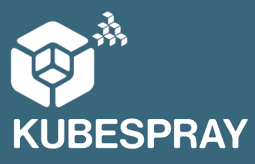

# **Kubespray**


# Supported Tags and respective `Dockerfile` links
* latest ([Dockerfile](https://github.com/vijayboopathy/automation/blob/master/docker/kubespray/Dockerfile))

# Quick Reference
* [Kubespray Official Documentation](https://kubernetes.io/docs/getting-started-guides/kubespray/)

# Maintained by
* This image is maintained by [**School of Devops**](http://schoolofdevops.com/)

# How to use this image?
* You can use this image by running,

```
docker run -it schoolofdevops/kubespray:latest
```

# Example
[](https://asciinema.org/a/xXNgfXE0gzSke1alxeAnIfkUk?speed=2&autoplay=1&loop=1&theme=asciinema&size=medium)
